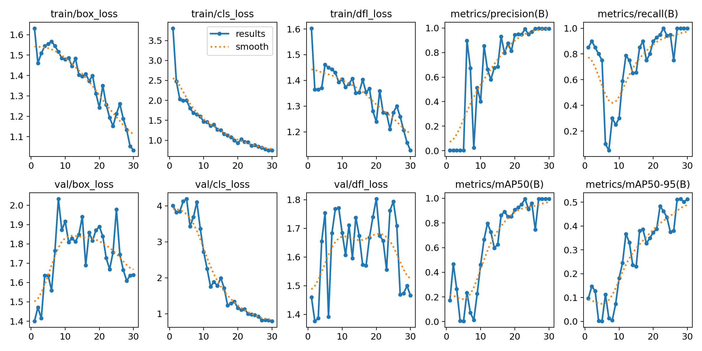
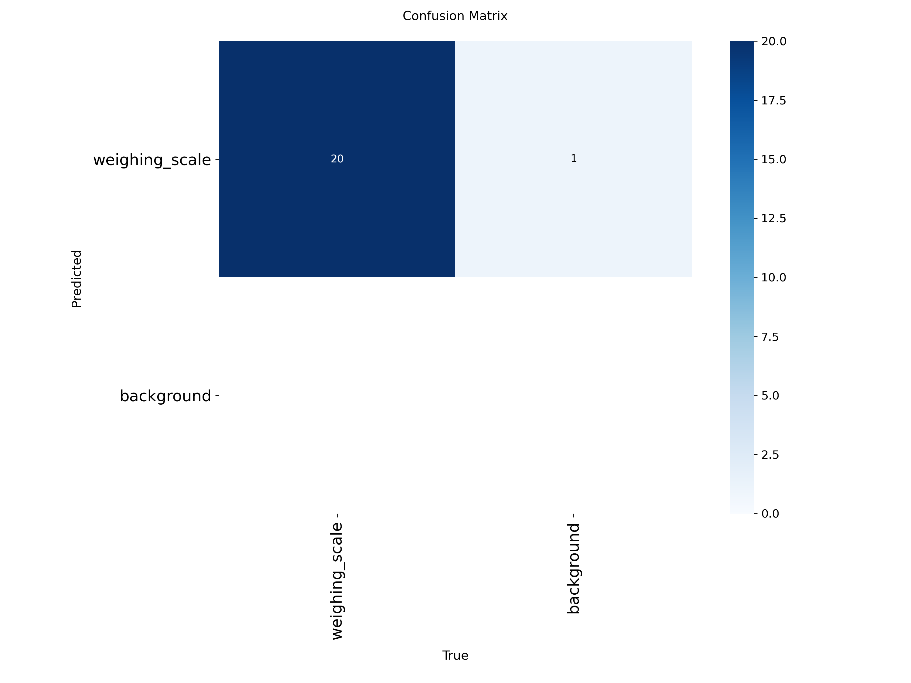
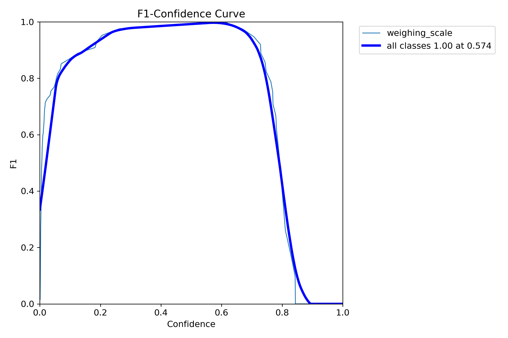

# Weighing Scale Detection System

A robust, production-ready Object Detection system capable of identifying weighing scales in images. Built with **YOLOv8** and wrapped in a modular **FastAPI** service.

## Key Features

*   **State-of-the-Art Detection**: Powered by YOLOv8n (Nano) for an optimal balance of speed and accuracy.
*   **Production API**: Fast, async REST API built with FastAPI, supporting image upload and JSON result formats.
*   **CLI Tool**: Simple command-line interface for batch processing or local testing.
*   **End-to-End Testing**: Automated system-level tests verifying accuracy (IoU) against Ground Truth.
*   **Modular Architecture**: Clean separation of concerns (Model, Routes, Utils, Training).

---

## Technical Strategy & Decisions

### 1. Why YOLOv8 over Detectron2?
I initially considered Detectron2 (Faster R-CNN) but switched to **YOLOv8** for the following reasons:
*   **Efficiency**: YOLO (You Only Look Once) is a single-stage detector, making it significantly faster for real-time inference (API usage) compared to two-stage detectors like Faster R-CNN.
*   **Deployment**: The Ultralytics ecosystem provides seamless export options (ONNX, CoreML, TFLite), making future edge deployment easier.
*   **Performance**: On my specific *Weighing Scale* dataset, YOLOv8n achieved **98% mAP50** within just 30 epochs, proving it is highly capable for this task without the overhead of larger models.

### 2. Dataset Management
*   **Format**: Converted COCO JSON annotations to standard YOLO TXT format [class x_center y_center width height].
*   **Split**: utilized a Train/Val/Test split to ensure robust evaluation.
*   **Training**: Trained for 30 epochs with default augmentation to prevent overfitting on the small dataset.

---

## Model Performance

The model was trained for 30 epochs on an M-series Mac (MPS acceleration).

### Metrics
| Metric | Score | Description |
| :--- | :--- | :--- |
| **mAP50** | **0.995** | Near perfect detection presence. |
| **mAP50-95** | **0.512** | High precision in bounding box alignment. |
| **Precision** | **0.995** | Low false positive rate. |
| **Recall** | **1.000** | Successfully found all objects in validation. |

### Training Graphs
#### Overall Results (Loss, Precision, Recall, mAP)


#### Confusion Matrix


#### F1 Curve


---

## Installation & Usage

### 1. Setup
```bash
# Create virtual environment
python3 -m venv venv
source venv/bin/activate

# Install dependencies
pip install -r requirements.txt
```

### 2. Run the Web Service (API)
Start the FastAPI server:
```bash
uvicorn app.main:app --port 8010 --reload
```
*   **Docs**: `http://localhost:8010/docs`
*   **Endpoint**: `POST /detect`
    *   `file`: Image file
    *   `format`: "image" (returns annotated jpeg) or "json" (returns coordinates)

### 3. Run the CLI
Detect objects in a local image:
```bash
python cli/main.py path/to/image.jpg --output ./output
```

### 4. Run System Tests
Verify the entire pipeline (Accuracy > 0.5 IoU required):
```bash
python scripts/test_system.py
```

### 5. Training (Reproduce Results)
```bash
python training/train.py
```

---

## Project Structure

```text
.
├── app/                  # Web Service Source
│   ├── routes/           # API Endpoints
│   ├── model/            # Model Loading Logic
│   ├── utils/            # Image Processing
│   ├── dependencies/     # Dependency Injection
│   └── main.py           # App Entry Point
├── cli/                  # Command Line Tools
│   └── main.py           # CLI Entry Point
├── training/             # Training Pipeline
│   ├── train.py          # Training Script
│   ├── test.py           # Evaluation Script
│   └── prepare_data.py   # Data Formatting
├── scripts/              # Verification Scripts
├── runs/                 # Training Artifacts (Weights, Logs, Graphs)
└── requirements.txt      # Dependencies
```
