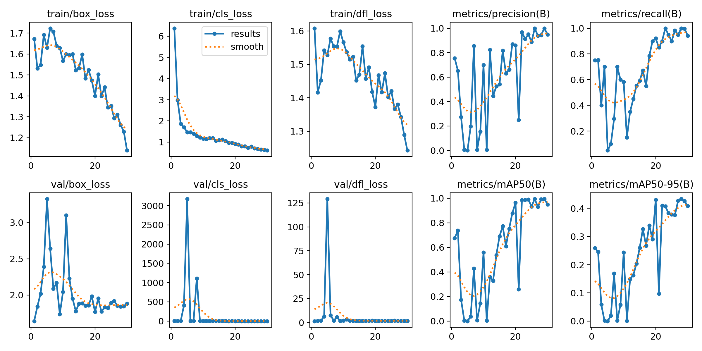
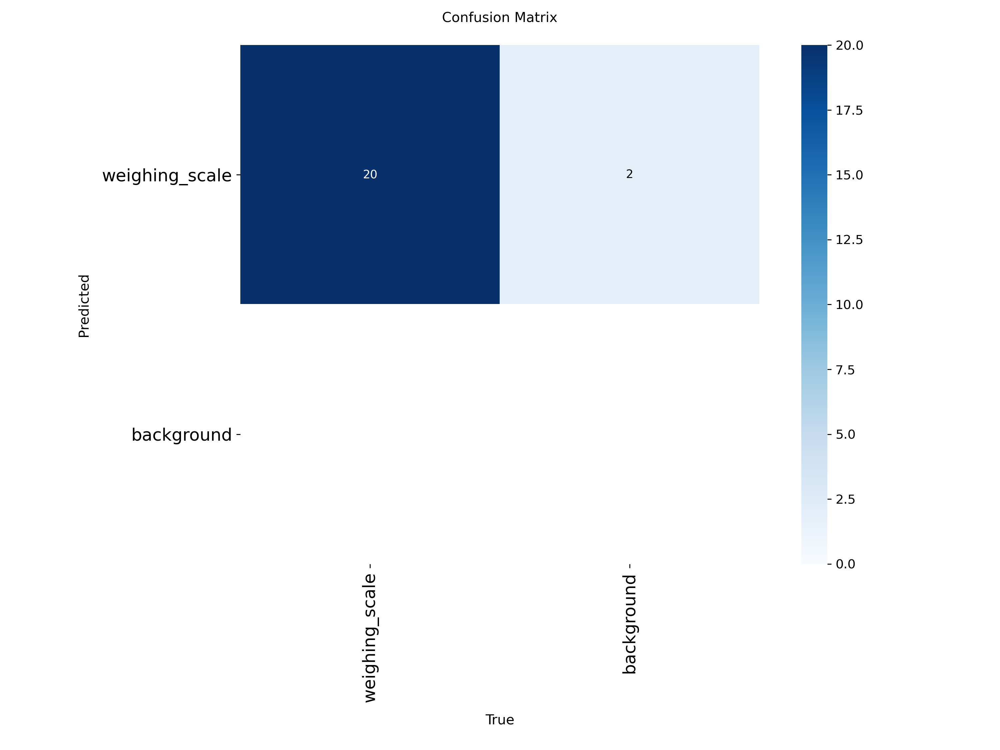

# Weighing Scale Detection System

A robust, production-ready Object Detection system capable of identifying weighing scales in images. Built with **YOLOv11** and wrapped in a modular **FastAPI** service.

## Key Features

*   **State-of-the-Art Detection**: Powered by **YOLOv11s** (Small) for an optimal balance of speed and high accuracy (0.993 mAP).
*   **Production API**: Fast, async REST API built with FastAPI, supporting image upload, JSON results, and dynamic thresholds.
*   **CLI Tool**: Simple command-line interface for batch processing or local testing.
*   **Comprehensive Testing**: Modular test suite including Unit, Integration, and End-to-End System tests.
*   **Thread-Safe Model Loading**: Robust Singleton loader to handle concurrent requests safely.
*   **Modular Architecture**: Clean separation of concerns (Model, Routes, Utils, Training).

---

## Technical Strategy & Decisions

### 1. Upgrade to YOLOv11
Initially using YOLOv8, the system has been upgraded to **YOLOv11s**:
*   **Precision and Performance**: Achieved **0.993 mAP50**, making it highly reliable for this dataset.
*   **Inference Speed**: Optimized for real-time inference on modern hardware, with full support for Apple Silicon (MPS).
*   **Deployment**: Uses the Ultralytics ecosystem for easy export to edge formats (ONNX, CoreML).

### 2. Built for Production
*   **Configuration**: Centralized settings using `pydantic-settings` for environment-variable driven portability.
*   **Robustness**: Validates file types (JPEG/PNG), size limits (10MB), and proper error handling for 400/503 status codes.
*   **Concurrency**: Uses a thread-safe `ModelLoader` to prevent race conditions during model initialization.

### 3. Dataset Management
*   **Format**: Converted COCO JSON annotations to standard YOLO TXT format [class x_center y_center width height].
*   **Split**: utilized a Train/Val/Test split to ensure robust evaluation.
*   **Download**: [Access Dataset Here](https://drive.google.com/drive/folders/1BWuMFP8JNYG5OT_zTo1JkrP_RXd7R5Dh?usp=sharing)

---

## Model Performance (YOLOv11s)

The model was trained for 30 epochs on an M-series Mac (MPS acceleration).

### Metrics
| Metric | Score | Description |
| :--- | :--- | :--- |
| **mAP50** | **0.993** | Near perfect detection presence. |
| **mAP50-95** | **0.434** | Solid precision in bounding box alignment. |
| **Precision** | **0.945** | Low false positive rate. |
| **Recall** | **1.000** | Successfully found all objects in validation. |

### Training Graphs
#### Overall Results (Loss, Precision, Recall, mAP)


#### Confusion Matrix


---

## Configuration

The application supports environment-based configuration. Copy `.env.example` to `.env` and customize:

```bash
cp .env.example .env
```

**Key Configuration Options:**
- `MODEL_PATH`: Path to trained model weights
- `CONFIDENCE_THRESHOLD`: Minimum confidence for detections (e.g., 0.1)
- `IOU_THRESHOLD`: IOU threshold for NMS
- `MAX_FILE_SIZE_MB`: Maximum upload file size (10)

---

## Installation & Usage

### Option 1: Local Development
**1. Setup Environment**
```bash
python3 -m venv venv
source venv/bin/activate
pip install -r requirements.txt
```

**2. Run the API**
```bash
python -m uvicorn app.main:app --port 8010 --reload
```
*   **Docs**: `http://localhost:8010/docs`
*   **Endpoint**: `POST /detect`
    *   `file`: Image file (JPEG/PNG, max 10MB)
    *   `format`: "image" (annotated) or "json" - optional

**3. Run the CLI**
```bash
python cli/main.py path/to/image.jpg --output results --conf 0.5
```

---

## Verification & Testing

The system includes a 3-tier testing strategy:

1.  **Unit Tests**: Validate core logic (image processing, detection filtering).
    ```bash
    pytest tests/unit/
    ```
2.  **Integration Tests**: Validate API endpoints and model integration.
    ```bash
    pytest tests/integration/
    ```
3.  **System Tests**: End-to-end verification against ground truth (IoU > 0.5).
    ```bash
    python scripts/test_system.py
    ```

---

## Project Structure

```text
.
├── app/                          # Web Service (FastAPI)
│   ├── main.py                   # Entry Point & Lifespan Management
│   ├── config.py                 # Centralized Settings (Pydantic-Settings)
│   ├── __init__.py
│   ├── dependencies/             # Dependency Injection Support
│   │   ├── __init__.py
│   │   └── core.py               # Model Dependency Provider
│   ├── model/                    # Model Management
│   │   ├── __init__.py
│   │   └── loader.py             # Thread-safe YOLO Loader (Singleton)
│   ├── routes/                   # API Endpoints
│   │   ├── __init__.py
│   │   └── detection.py          # /detect Endpoint (Validation & Formatting)
│   └── utils/                    # Shared Utilities
│       ├── __init__.py
│       ├── detection.py          # Shared Box Filtering Logic (DRY)
│       └── image.py              # PIL Processing Helpers
│
├── cli/                          # Command Line Interface
│   ├── __init__.py
│   └── main.py                   # CLI Tool using Shared Utilities
│
├── training/                     # Training & Pipeline
│   ├── prepare_data.py           # COCO to YOLO Converter
│   ├── test.py                   # Model Evaluation Script
│   └── train.py                  # Configurable YOLO Training Script
│
├── scripts/                      # System Verification
│   ├── __init__.py
│   └── test_system.py            # End-to-End IoU Validation
│
├── tests/                        # Modular Test Suite
│   ├── conftest.py               # Test configuration & shared fixtures
│   ├── unit/                     # Unit Tests for Utils
│   │   ├── test_detection_utils.py
│   │   └── test_image_utils.py
│   └── integration/              # Integration Tests for API Endpoints
│       └── test_api.py
│
├── runs/                         # Training Artifacts (Auto-generated)
│   └── detect/                   # YOLO Training Runs
│       ├── train/                # Legacy YOLOv8 Run
│       ├── train2/               # YOLOv11s Run Results
│       │   ├── weights/          # best.pt, last.pt
│       │   ├── results.png       # Metrics visualization
│       │   └── confusion_matrix.png
│       ├── val/                  # Validation outputs
│       └── val2/
│
├── test_output/                  # Test Results (Auto-generated)
│   ├── annotated_*.jpg           # CLI annotated output samples
│   └── api_result.jpg            # API test output
│
├── .env                          # Local Environment Config
├── .env.example                  # Environment Template
├── Dockerfile                    # Production Container Definition
├── docker-compose.yml            # Container Orchestration
├── requirements.txt              # Project Dependencies
├── README.md                     # Project Documentation
├── yolo11s.pt                    # Pre-trained YOLOv11 Small Base
└── yolov8n.pt                    # Pre-trained YOLOv8 Nano Base
```
```
